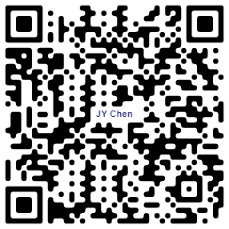
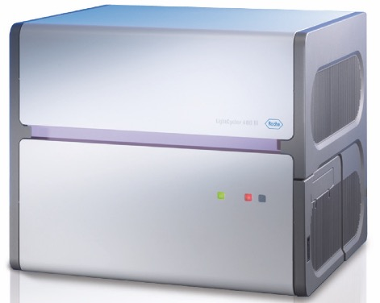

```{r theme setup, include=FALSE, warning=FALSE}
library(xaringanthemer)
style_duo_accent()
xaringanExtra::use_xaringan_extra(c("tile_view", "animate_css", "panelset"))

```

class: middle, center

Presentation slide: https://lazyliondog.github.io/realtimePCR/  

  

[簡要中文操作手冊下載](https://github.com/LazyLionDog/realtimePCR/raw/master/LC480_Software1.5.pdf)  
(按下去才會下載！)  

閱覽過程，隨時可按 "h" 參考操作說明。

---
## Polymerase chain reaction

- PCR
- Thermal cycle

.center[]

<div style="font-size: 15px;">

.footnote[Source: [Polymerase chain reaction](https://commons.wikimedia.org/wiki/File:Polymerase_chain_reaction.svg)]

</div>

---

## Amplification curve

.pull-left[

<ul style="font-size: 30px;">
Four phases for PCR  
<li> Ground
<li> Exponential
<li> Linear
<li> Plateau
</ul>

]

.pull-right[.center[
<div style="font-size: 40px; color: #4169e1;">
2<sup>n</sup> / cycle
]]

.footnote[Reference DOI: [10.1100/tsw.2011.124.](https://doi.org/10.1100/tsw.2011.124)]

???
- PCR反應可以依照產物的生成量，分為幾個階段
1. 基礎期
2. 指數期
3. 線性期
4. 平原期

- 如同第一張簡報所呈現的，通常我們認為是以 2 的倍數來放大所要檢測的目標基因 (2 的 n 次方)
- 問題來了！ n 代表的是什麼？ 是否跟這個圖形相符？

---

## PCR efficiency

.pull-left[.center[]

]

--

<span style="position: absolute; top: 180pt; left: 450pt;">

<font style="font-size: 30px; color: red;">In theory!</font>
</span>

???
- 這個才是真的 2<sup style="font-size:6pt;">n</sup> 曲線！
- 理想總是太豐滿，現實確是很骨感… 是什麼因素造成骨感的現實？

---
background-image: url("04KHV.jpg")
background-size: cover
class: center, bottom, inverse

--
<ul style="font-size: 30px; color: #4d4dff; position: absolute; right: 40pt; top: 50pt; text-align: left;">Reality!
<font style="color: #FFFFFF;">
<li>Quality of DNA template</li>
<li>DNA polymerase activity</li>
<li>dNTP concentration</li>
Primers design and concentration...
</font>
</ul>

???
這張圖你看到了什麼？ 特別是第二條 lane 的位置  
什麼原因可能造成這樣的結果？  
有許多因素可能影響 PCR/real-time PCR 的擴增效率，這些因素可能可以被優化，也有可能無法優化

---
class: center, middle

# Real-time PCR  

---

## Real-time PCR machines

<table style="border:0;">
<thead>
<tr>
<th> Roche </th>
<th> Bio-Rad</th>
<th> Applied Biosystems</th>
<th> Qiagen</th>
<tr>
</thead>
<tbody style="text-align: center;">
<td>LightCycler<sup>®</sup>480<br></td>
<td>CFX96 Touch<sup style="font-size:12px;">TM</sup><br></td>
<td>StepOne<sup style="font-size:12px;">TM</sup><br></td>
<td>Rotor-Gene Q<br></td>
<tr>
</tbody>
</table>

- and others... 

---
class: center, middle

# Basic introduction

---

## Applications

<table style="border: 0; width: 600pt;">
<thead>
<tr>
<th style="vertical-align:middle;">Gene detection
<th style="vertical-align:middle;">Gene expression
<tr>
</therd>
<tbody>
<td style=" width:300px;">
<UL>
<li>Species identification</li>
<li>Pathogens screening</li>
<li>Diseases diagnosis</li>
<li>Antibiotic resistance gene</li>
</UL>
<td style=" width:300px;">
<ul>
<li>Genotyping
<li>Food safety analysis
<li>Gene knockdown
<li>Pharmacy researches
</ul>
<tr>
</tbody>
</table>

???
還可以幹麻呢？

---

## Trends of publications using Real-time PCR

.pull-left[

<div class="left" style="font-size: 18px; margin: 10px;">


Number of publications in PubMed related to qPCR.<br>

</div>
]

.pull-right[

<div class="right" style="font-size: 18px; text-align: left; margin: 10px;">


<br>
Summary of the research articles published in different journals.

</div>

]

<div style="font-size: 15px;">

.footnotep[
Reference DOI:  
[10.1016/j.bdq.2014.08.002](https://doi.org/10.1016/j.bdq.2014.08.002)  
[10.1007/s13197-016-2205-0](https://doi.org/10.1007/s13197-016-2205-0)
]

</div>

---

## Two major detection format

<div style="font-size: 30px;">

- Non-specific dsDNA binding dyes<p>

- Sequence-specific fluorescence detection chemistry

</div>

---

## SYBR green I


<div style="text-align: left;">
<dl style="font-size: 25px;">
  <dl>Indiscriminate binding into any dsDNA</dl>
  <dd> - Primer dimers</dd>
  <dd> - Sample DNA quality</dd>
  <dd style="color: red;"> - Melting curve analysis (<I>Tm</I> calling analysis)
  
</dl>
</div>


<div style="font-size:15px;">

.footnote[
Reference DOI: [10.1038/sj.leu.2402922](https://doi.org/10.1038/sj.leu.2402922)
]

</div>

---

## Melting curve analysis


.center[]

<div style="font-size:15px;">

.footnote[
Reference DOI: [10.1002/9780470027318.a1406.pub2](https://doi.org/10.1002/9780470027318.a1406.pub2)
]

</div>

---

## Hybridization probe

.panelset[
.panel[.panel-name[TaqMan probe]


]
.panel[.panel-name[Fluorescence Resonance Energy Transfer (FRET)]


]]

<div style="font-size:10px; position: absolute; bottom: 5pt;">
Reference DOI: <a href="https://doi.org/10.1038/sj.leu.2402922">10.1038/sj.leu.2402922</a>
</div>

---
background-image: url("15allformat_1.jpg")
background-size: contain
class: bottom, left

<div style="font-size:10px; position: absolute; bottom: 5pt;">
Reference DOI: <a href="https://doi.org/10.1007/s13197-016-2205-0">10.1007/s13197-016-2205-0<a></div>

---
class: center, middle

# How to design my real-time PCR?

---
## Resource

.center[[](https://doi.org/10.1002/bmb.20461)]
.center[點按下載 paper]

---
class: center

## Online software

.panelset[
.panel[
.panel-name[Primer design]

<figure style="position: absolute; top: 80pt; left:100pt;">
<figcaption>Primer3</figcaption>
<a href="http://bioinfo.ut.ee/primer3-0.4.0/"></a>
</figure>
<figure style="position: absolute; top: 80pt; right: 100pt;">
<figcaption>Beacon</figcaption>
<a href="http://www.premierbiosoft.com/qOligo/Oligo.jsp?PID=1"></a>
</figure>
]

.panel[
.panel-name[Product structure]

<figure>
<figcaption>mfold</figcaption>
<a href="http://www.unafold.org/"></a>
</figure>

]

.panel[
.panel-name[Sequences alignment]

<figure>
<figcaption>Clustal omega</figcaption>
<a href="https://www.ebi.ac.uk/Tools/msa/clustalo/"></a>
</figure>

]
]

<div style="font-size: 10px; position: absolute; bottom: 10pt;">
Reference DOI: <a href="https://doi.org/10.1002/pro.3290">10.1002/pro.3290</a>
</div>

---

## Example

.panelset[
.panel[.panel-name[Primer design and sequences]


]
.panel[.panel-name[Structure]
.center[]
]
]

???
因為primer辯認複雜結構的關係，擴增效率極差！

---
class: center, middle

# Data analysis

---
background-image: url("26qPCR_Flowchart.jpg")
background-size: contain
class: bottom, left

<div style="font-size:15px;">
.footnote[
Reference DOI:<br>[10.1016/j.bdq.2014.08.002](https://doi.org/10.1016/j.bdq.2014.08.002)
]
</div>

---

## Quantification

● Cp calculation  
  
● Absolute  
  
● Relative  
  
● <i>Tm</i> calling analysis (Melting curve analysis)

--


---
## Cp calculation

.pull-left[
<ul>
<li>Following are the same concept!
<ul style="color:#2894FF;">
<li>Crossing poing (Cp)  
<li>Cycle quantification (Cq)  
<li>Cycle threshold (Ct)  
<li>Take-off point (TOP)  
</ul>
<br>
<li>各廠牌設備計算方式略有不同！  
<li>Minimum Information for Publication of Quantitative Real-Time PCR Experiments (<a href="#52">MIQE</a>) 
</ul>

]

.pull-right[


]

<div style="font-size:15px;">
Picture source: <a href="https://toptipbio.com/ct-value-qpcr/">What Is A Cycle Threshold (Ct) Value In qPCR?</a>
</div>

---

background-image: url("28PCREfficiency.jpg")
background-size:contain

.footnote[[Source](http://www.gene-quantification.de/pfaffl-qPCR-efficiency1.gif)]

---
## PCR efficiency (I)

PCR product number at the number of Cp

> $N = N_{0}\times E^{Cp}$

Linearise

> $LogN = LogN_{0}+Cp\times LogE$

Calculate the "Cp" and describe the PCR amplification

> $Cp=-(\frac{1}{LogE})LogN_{0}+\frac{LogN}{LogE}$

--

**Slope of this equation!**

--

**Plot the equation...**

---

## PCR efficiency (II)

.pull-left[.center[]]

.pull-right[
<div style="text-align:left; font-size:28px; color:blue;">

PCR efficiency "E" can be described as

</div>

> $$E = 10^{-\frac{1}{Slope}}$$
 
.center[or]

> $$E(\%) = -1 + 10^{-\frac{1}{Slope}}$$

]

---

## Absolute quantification

.panelset[

.panel[
.panel-name[Second-derivative maximum method]

- <font style="color:#2894ff;">Standard method (highly recommended!)</font>

.center[]

- 其他圖示說明請按"p"

]

.panel[
.panel-name[Fit point method]

- Optional, user defined


]]


<div style="font-size:12px; position: absolute; bottom: 10pt;">
Reference DOI: <a href="https://doi.org/10.1002/9780470027318.a1406.pub2">10.1002/9780470027318.a1406.pub2</a>
</div>

???


---

## Relative quantification (I)

<div style="font-size:25px; text-align:left;">
<ul>
<li> Determination of mRNA expression level
<li> Gene dosage quantification
<li>Relative to <font style="color:red;">reference gene</font> and/or <font style="color:red;">calibrator sample</font>
</ul>
</div>

.center[
<div style="font-size: 18px; text-align:left; color: #888888;">]

.left[- SA: stable angina (穩定型心絞痛)<br>
- ACS: acute coronary syndrome (急性冠心症)]
</div>

<div style="font-size:12px; position: absolute; bottom: 5pt;">
Reference DOI: <a href="https://doi.org/10.5114/aoms.2014.44871">10.5114/aoms.2014.44871</a>
</div>

---

## Relative quantification (II)  

.pull-left[


$$Relative\ ratio =\frac {Target\ gene\ conc.}{Reference\ gene\ conc.}$$
  
  
  
**Reference gene:**

- Unaffected by experiment conditions (non-regulated)  
- Wide variety of cellular processes  
- One or more reference can be used  

]

.pull-right[

- Selection of reference gene

<a href="https://doi.org/10.1016/j.bbrc.2003.11.177">

</a>

]

<div style="font-size:15px; position: absolute; bottom: 20pt;">
Reference DOI: <a href="https://doi.org/10.1016/j.bbrc.2003.11.177">10.1016/j.bbrc.2003.11.177 (被引用1,367次)
</div>

---

## Relative quantification (III)


**Optional:**

$$Calibrator\ Normalize\ Ratio = \frac{\frac{Target\ gene\ concentration}{Reference\ gene\ concentration}(Sample)}{{\frac{Target\ gene\ concentration}{Reference\ gene\ concentration}(Calibrator)}}$$


**Calibrator:**
<ul>
<li>Correct the differences in detection sensitivity between 
<ul>
<li>Target / Reference gene
<li>several experiments (e.g., long-term studies)  
</ul>
<li>Not treated cell line  
<li>Sample before experiment
</ul>

---

## Relative quantification (IV)

<br>

Efficacy = 2 → ( $2^{\Delta\Delta CT} method$ )

<br>

Efficacy adjust (linear) - using standard curve

---

## Relative quantification (V)

.center[]

---

## <i>Tm</i> Calling analysis

.center[]

???
Tm calling analysis = melting curve analysis  
初步鑑別產物的特異性  
其他應用的可能？  


---

## Genotyping / Serotyping

.pull-left[
● Random amplified polymorphic DNA (RAPD)  

] 

.pull-right[
● Restriction fragment length ploymorphism (RFLP)

]

<div style="font-size:12px; position: absolute; bottom: 50pt; right: 50pt;">
Source: <a href="https://www.differencebetween.com/difference-between-rapd-and-vs-rflp/K">Difference Between RAPD and RFLP</a>
</div>

---

## For example

.center[]

<div style="font-size:15px;">
.footnote[
DOI: [10.1128/JCM.01991-15.](http://doi.org/10.1128/JCM.01991-15)]
</div>

???
但是跑膠的時候仍有可能出現問題！？
當 15 個血清型一起跑的時候，可以看出差異，但是如果只有單一樣本在跑，則在測定的時候一要算得極準確，但是像鏡頭週邊彎曲，造成影像失真，就會影響判讀結果。

---

## DNA binding dyes

.pull-left[.center[]]

.pull-right[.center[]]

<div style="font-size:15px; position: absolute; bottom: 20pt;">
DOI: <a href="http://doi.org/10.1007/s10895-012-1059-8">10.1007/s10895-012-1059-8</a>
</div>


???
url("68sybr.jpg")


---

## EvaGreen binding dye

.center[]

.center[]

<div style="font-size:15px;">
.footnote[
DOI: [10.1039/c7cp06058k](http://doi.org/10.1039/c7cp06058k)]

---

## High-resolution meltign analysis

.pull-left[● Original fluorescence data  ]

.pull-right[● Normalized data  ]

<div style="font-size:15px;">
.footnote[
DOI: [10.2217/14622416.8.6.597](http://doi.org/10.2217/14622416.8.6.597)]
</div>

---

## High-resolution meltign analysis

.panelset[
.panel[.panel-name[Sequence alignment]
.ecnter[]
]
.panel[.panel-name[HRM]
.center[]
]
]

???


---

# Droplet Digital PCR

.center[]

<div style="font-size:15px;">
.footnote[
DOI: [10.1002/cphg.58](http://doi.org/10.1002/cphg.58)]
</div>

---

## Analysis tool

.panelset[
.panel[.panel-name[LightCycler480]


]
.panel[.panel-name[Other analysis tools]


]]

<div style="font-size:10pt; position: absolute; bottom: 15pt;">
Reference DOI:
<a href="https://doi.org/10.1016/j.bdq.2014.08.002">10.1016/j.bdq.2014.08.002</a>
</div>

---
class: center, middle

# The MIQE guidelines

---

background-image: url("38atcrosspurpose.jpg")
background-size: contain

---

background-image: url("39fun2.jpeg")
background-size: cover

---

background-image: url("40Machines.jpg")
background-size: contain
class: bottom, left

<div style="font-size: 15px;">
.footnote[Reference DOI:<br> [10.1016/j.bdq.2015.01.005](http://dx.doi.org/10.1016/j.bdq.2015.01.005)]
</div>

???
- 不同廠牌的機器，對於同一基因，在相同反應條件下，有不同的擴增效率
- 同一台機器，對於不同基因，擴增效率也不見得都一致
- 就算是同一台設備，對同一項基因檢測，也會發現其分佈零亂

---
background-image: url("41DifferentSystem.jpg")
background-size: contain

<div style="font-size: 15px;">
.footnote[Reference DOI:<br> [10.1016/j.mcp.2010.04.002](http://dx.doi.org/10.1016/j.mcp.2010.04.002)]
</div>

---

background-image: url("42DiffMelt.jpg")
background-size: contain

---
## MIQE

- <font style="color:red;">M</font>inimum <font style="color:red;">I</font>nformation for Publication of <font style="color:red;">Q</font>uantitative Real-Time PCR <font style="color:red;">E</font>xperiments, (2009)

- Publication: 
> [The MIQE Guidelines: Minimum Information for Publication of Quantitative Real-Time PCR Experiments](https://doi.org/10.1373/clinchem.2008.112797)

- [MIQE & PCR (2016, Jun)](https://itunes.apple.com/us/book/miqe-qpcr/id993276375?mt=11)

.center[]

---

## Other guidelines and informations

- 其他規範 real-time PCR 發表的指引
> [Guidelines for validation of qualitative real-time PCR methods](https://doi.org/10.1016/j.tifs.2014.03.008)

- 關於評估 real-time PCR 反應效率
> [How good is a PCR efficiency estimate: Recommendations for precise and robust qPCR efficiency assessments](https://doi.org/10.1016/j.bdq.2015.01.005)

- 決定檢測的極限範圍
> [Evaluation of real-time PCR results at the limit of detection](https://doi.org/10.1007/s00003-011-0669-4)


---
class: center, middle

# [LightCycler<sup>®</sup> 480 Instrument<br><font style="font-size:15px;">點按連結原廠網站</font>](https://lifescience.roche.com/en_tw/products/lightcycler14301-480-instrument-ii.html)

---

## General of LC480

.pull-left[]

.pull-right[.center[<br>
]]

???
待機時產熱 900 kj/h
運轉時產熱 4200 kj/h

---
## Enviroment parameters


<div style="text-align:left; font-size: 25px; position: absolute; z-index: 7; bottom: 20pt;">
<ul>
<li style="color:red;">機器使用時，請將冷氣開啟，以維持溫度 (大約 26°C左右)。
<li style="color:red;">冷氣開啟時，請注意隨手關門！
</ul>
</div>

---

## LightCycler<sup>®</sup> 480

.panelset[

.panel[.panel-name[設備外觀]

.pull-left[.center[]]
.pull-right[.center[]]

]

.panel[.panel-name[Plate loader]

.pull-left[.center[]]

.pull-right[.center[]
<font style="color:red; font-size:20px; font-weight:900;">限定使用Roche原廠耗材！<br>(盤子與封模，唯一限定的材料)]

]

.panel[.panel-name[Thermal cycler]

.pull-left[.center[]]
.pull-right[.center[]]

]

.panel[.panel-name[Optical system]

.pull-left[ 
.center[]]
.pull-right[.center[]]

.panel[.panel-name[Filter set]

.pull-left[
.center[]
]
.pull-right[
.center[]
- 一定要注意 dye 的選用搭配哦！
]]]]


???
白盤耗材 台中銷售商：永馥  
TEL：04-22362138  
LightCycler® 480 Multiwell Plate 96, white (白盤)  
Product No. 04729692001  
Pack Size: 50 plates with foils (50 盤含封膜)  
其他耗材亦可參考原廠網站


其他波段資料 [[Bio-rad 連結](https://www.bio-rad.com/webroot/web/images/lsr/products/amplification_pcr/product_overlay_content/global/lsr_384_excite_emiss_wave.jpg)] 

---

## LightCycler<sup>®</sup> 480 - Xenon lamp (氙)

.center[]

---

## 請大家共同遵守這些事

.pull-left[
<ul style="font-size: 20pt;">
<li> 使用前登記，安排實驗次序。
<li> 注意空調，維持機器運作時的室內溫度
<li> 限定使用原廠白盤及封膜！<br>(未遵守者禁止使用)
<li> 請算好操作的時間，不要開著機器燒！<br>(燈泡滿貴的)
<li> 如果有問題，請和實驗室前輩/學長姊討論。
</ul>
]

.pull-right[
<font style="font-size: 20pt;">
 使用中，如果遇到設備故障，請聯絡原廠工程師，並且請轉知所上老師。 
<ul>
  <li> <b style="color: red;">上班時間</b>維修專線 (Mon-Fri, 8:45~17:30)
  <li> 0800-258-458
  <li> <b style="color:red;">非上班時間</b>維修專線
  <li> 北區 0928-256-624
  <li> 中區 0910-387-746
  <li> 南區 0910-387-748
  </ul>
</font>
]

---
class: center, middle

# <b style="color: #66a3ff;">Thank you!</b>

